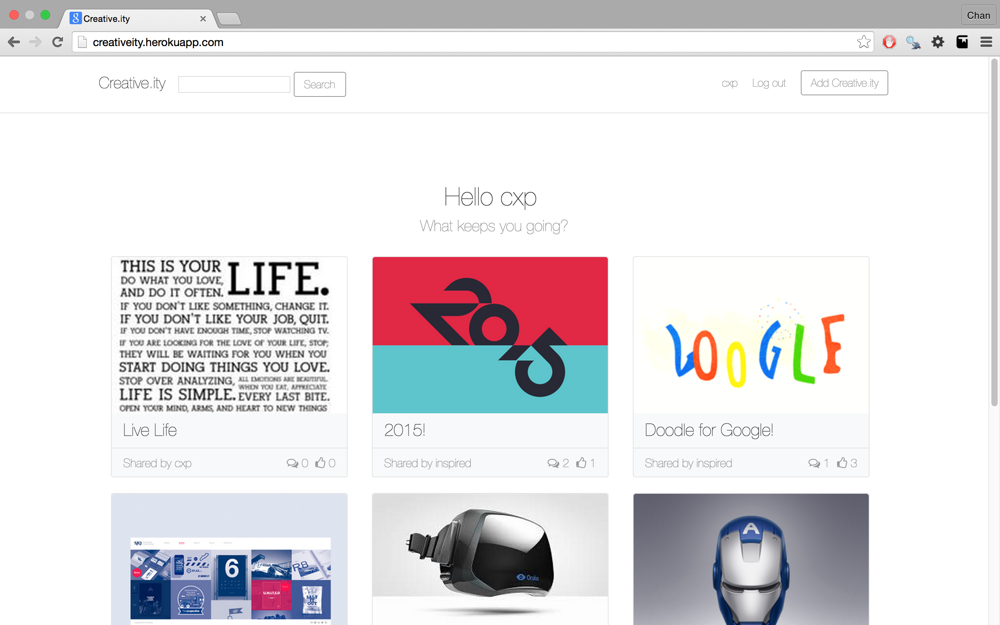
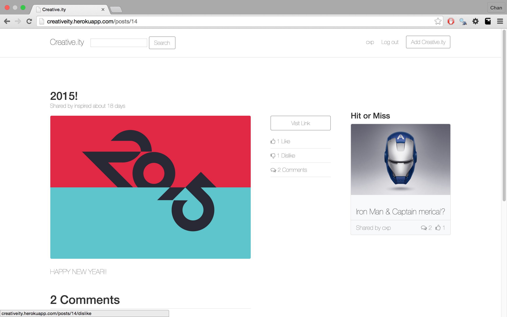

Creative.ity
======

 

Creative.ity is an App where people can come and share their inspiration. This is a place where people can come and get motivated in the work they make and do. This was just a side-project during my time at Launch Academy.

Here are some screenshots of Creative.ity

Home Page

Show Page

Jan 31st, 2015
- added google analytics

**Things to do**
- Twitter Authentication to allow people to tweet an image from Creative.ity
